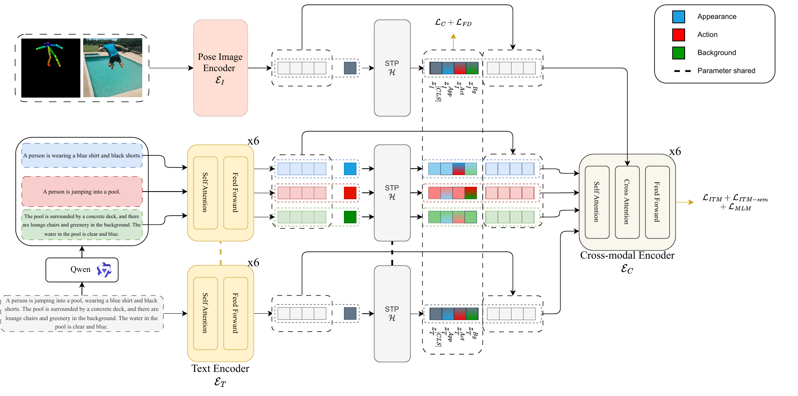

# (ECCV 2026) Divide and Align: Disentangled Vision-Language Learning for Text-Based Person Anomaly Search


## Architecture


## Results

| Method | Data | R@1 | R@5 | R@10 | mAP |
|---|---:|---:|---:|---:|---:|
| MRA | 0.1M | 70.53 | 94.69 | 97.47 | 81.59 |
| APTM | 0.1M | 72.14 | 95.30 | 97.17 | 82.78 |
| CAMeL | 0.1M | 74.30 | 96.79 | 98.84 | 84.20 |
| WoRA | 0.1M | 74.47 | 96.82 | 98.48 | 84.60 |
| IRRA | 0.1M | 76.39 | 97.62 | 99.14 | 86.33 |
| CLIP | 0.1M | 77.60 | 98.84 | 99.75 | 87.35 |
| RaSa | 0.1M | 80.79 | 98.89 | 99.65 | 89.20 |
| X-VLM | 0.1M | 81.95 | 98.84 | 99.19 | 89.86 |
| CMP | 0.1M | 83.06 | 98.89 | 99.49 | 90.41 |
| CMP | 1M | 84.93 | 99.09 | 99.75 | 91.66 |
| **Ours** | 0.1M | <u>85.14</u> | <u>99.24</u> | <u>99.80</u> | <u>91.83</u> |
| **Ours** | 1M | **86.45** | **99.44** | **99.85** | **92.59** |

## Models and Weights
The checkpoints `seda.pth` and training log have been released at
[HuggingFace](https://huggingface.co/MaverickAlex/SeDA)

The splitted caption of the dataset can be found on [HuggingFace](https://huggingface.co/datasets/MaverickAlex/PAB-splitted-caption)


## Usage

Create conda environment and install dependencies:

```sh
conda create -n SeDA python=3.10
conda activate SeDA
# Ensure torch >= 2.0.0 and install torch based on CUDA Version
# For example, if CUDA Version is 11.8, install torch 2.2.0:
pip install torch==2.2.0 torchvision==0.17.0 torchaudio==2.2.0 --index-url https://download.pytorch.org/whl/cu118
pip3 install -r requirements.txt
```

For the first time you use wordnet
```
python
>>> import nltk
>>> nltk.download('wordnet')
```

### Parameter Initialization

Download pre-trained models for parameter initialization:

Initializing parameters from [X-VLM (16M)](https://github.com/zengyan-97/x-vlm): 
[16m_base_model_state_step_199999.th](https://drive.google.com/file/d/1iXgITaSbQ1oGPPvGaV0Hlae4QiJG5gx0/view?usp=sharing)

Text tokenizer/encoder: [bert-base-uncased](https://huggingface.co/bert-base-uncased/tree/main)

Image encoder: [swin-transformer-base](https://github.com/SwinTransformer/storage/releases/download/v1.0.0/swin_base_patch4_window7_224_22k.pth)

Organize `checkpoint` folder as follows:

```
|-- checkpoint/
|    |-- 16m_base_model_state_step_199999.th
|    |-- bert-base-uncased/
|    |-- swin_base_patch4_window7_224_22k.pth
```


### Datasets Prepare

Download the annotation and put inside the folder annotation/train_decouple

```
|-- PAB/
|    |-- annotation/
|        |-- train_decouple/
|            |-- attr_0.json
|            |-- ...
|        |-- test/
|            |-- attr.json
|            |-- ucc.json
|        |-- source_caption.json
|    |-- train/
|        |-- imgs_0/
|            |-- goal/
|                |-- 0.jpg
|                |-- ...
|            |-- wentrong/
|            |-- full/
|        |-- imgs_1/
|        |-- ...
|    |-- test/
|        |-- 0.jpg
|        |-- ...
|    |-- ucc/
|    |-- pose/
|        |-- train/
|            |-- imgs_0/
|            |-- ...
|        |-- test/
|        |-- ucc/
```


### Training
We train our SeDA using PAB as follows：

```
python3 run.py --task "cmp_decouple" --dist "f4" --output_dir "output/cmp"
```


### Evaluation

```
python3 run.py --task "cmp_decouple" --evaluate --dist "f2" --output_dir "output/SeDA" --checkpoint "ckpt.pth"
```

### Cite us

```
```

### Ack
This repository builds upon [CMP](https://github.com/Shuyu-XJTU/CMP), and we gratefully acknowledge its authors for their work.